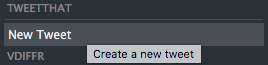
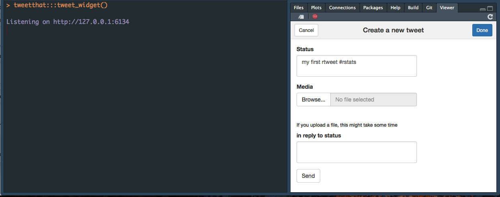

---
output:
  md_document:
    variant: markdown_github
---

<!-- README.md is generated from README.Rmd. Please edit that file -->

```{r, echo = FALSE}
knitr::opts_chunk$set(
  collapse = TRUE,
  comment = "#>",
  fig.path = "README-", 
  eval = FALSE
)
```

# tweetthat

  [](https://img.shields.io/badge/lifecycle-experimental-orange.svg)


A simple wrapper to tweet straight from your R session. 

+ Open a widget to send tweets (you'll need a Twitter token to do that)

+ Opens your browser with a text ready to tweet. You need to add a text, and url & via are optional. 

## Install 

```{r}
devtools::install_github("ColinFay/tweetthat")
```

## With the widget

Using the widget allows you to send images from your computer: 





Before using the widget, you should create a Twitter App with POST permission on apps.twitter.com. Then run : 

```{r}
## whatever name you assigned to your created app
appname <- "rtweet_token"

## api key (example below is not a real key)
key <- "XYznzPFOFZR2a39FwWKN1Jp41"

## api secret (example below is not a real key)
secret <- "CtkGEWmSevZqJuKl6HHrBxbCybxI1xGLqrD5ynPd9jG0SoHZbD"

## create token named "twitter_token"
twitter_token <- create_token(
  app = appname,
  consumer_key = key,
  consumer_secret = secret)
```

(taken from the rtweet vignette)

## With the function

The function doesn't need a Twitter token, but you can't send image from your computer.


```{r}
library(tweetthat)
tweet_that(text = "I wrote this tweet in RStudio, how cool is that?")
```

```{r}
tweet_that(text = "This website is awesome", url = "http://colinfay.me")
```

```{r}
tweet_that(text = "Colin's Twitter is full of advices", via = "@_colinfay")
```

```{r}
tweet_that(text = "#RStats — Colin's website is cool", url = "http://colinfay.me", via = "@_colinfay")
```

